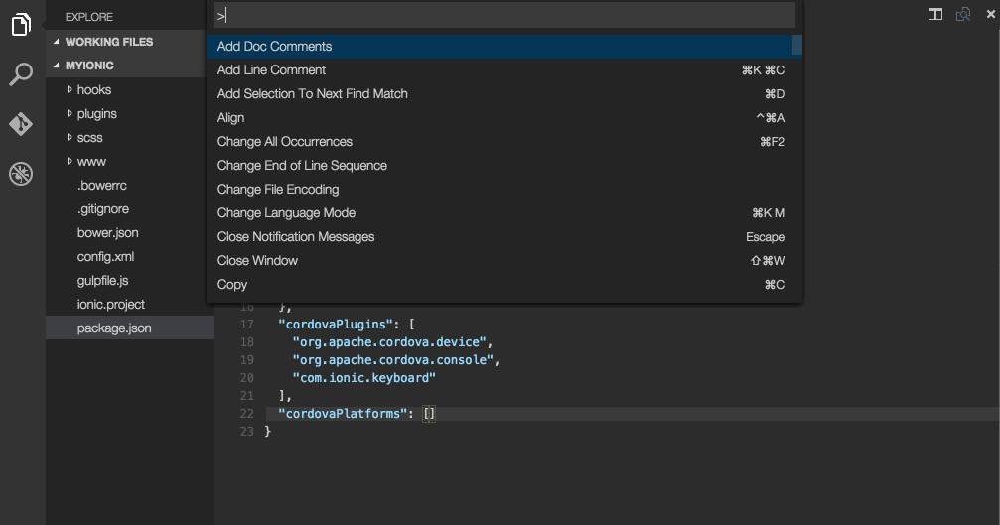

[](https://travis-ci.org/dkundel/vscode-new-file)
[](#contributors)


# Advanced New File - Visual Studio Code Extension

Making the creation of a new file even easier. Specify the name of the file on creation and if you define a path that doesn't exist yet the folders will be created.
Before using the extension please make sure to read the [Disclaimer](#Disclaimer).

> Inspired by [Scott Kuroda]()'s [AdvancedNewFile](https://github.com/skuroda/Sublime-AdvancedNewFile) for Sublime.

## How to use



1. a) Press the Shortcut <kbd>Cmd+Alt+N</kbd> or run the `Files: Advanced New File` command.
1. b) Right click in the explorer menu and choose 'Advanced New File'.

2. Enter a relative file path or stick with the default. If you have a file open it will guess the extension based on the current extension.

3. An empty file will be created and the cursor will be placed into the new file.

4. Happy Coding! :)  

## Configuration

You can configure the default behavior through various settings in your `settings.json`:

```js
{
  "newFile.defaultBaseFileName": "newFile",
  "newFile.relativeTo": "file", // "root" or "project"
  "newFile.defaultFileExtension": ".ts",
  "newFile.rootDirectory": "~",
  "newFile.showPathRelativeTo": "root", // "project" or "none"
  "newFile.expandBraces": false // setting to true will allow for creating multiple files such as `new-folder/{file1,file2}.js`
}
```

You can also set a new keyboard shortcut for the command in `keybindings.json`:

```json
[
  {
    "key": "cmd+n",
    "command": "newFile.createNewFile"
  }
]
```

## How to contribute

1. Download source code and install dependencies
```
git clone git@github.com:dkundel/vscode-new-file.git
cd vscode-new-file
npm install
code .
```
2. Make the respective code changes.
3. Go to the debugger in VS Code, choose `Launch Extension` and click run. You can test your changes.
4. Choose `Launch Tests` to run the tests.
5. Submit a PR.

## Backlog

  - Add additional tests

## Disclaimer

**Important:** This extension due to the nature of it's purpose will create
files on your hard drive and if necessary create the respective folder structure.
While it should not override any files during this process, I'm not giving any guarantees
or take any responsibility in case of lost data.

## Contributors

Thanks goes to these wonderful people ([emoji key](https://github.com/kentcdodds/all-contributors#emoji-key)):

<!-- ALL-CONTRIBUTORS-LIST:START - Do not remove or modify this section -->
| [<br /><sub>Carl Henderson</sub>](https://github.com/chuckhendo)<br />[💻](https://github.com/dkundel/vscode-new-file/commits?author=chuckhendo "Code") | [<br /><sub>Chris Walker</sub>](http://thechriswalker.github.com/)<br />[💻](https://github.com/dkundel/vscode-new-file/commits?author=thechriswalker "Code") | [<br /><sub>Telokis</sub>](https://github.com/Telokis)<br />[💻](https://github.com/dkundel/vscode-new-file/commits?author=Telokis "Code") | [<br /><sub>Patrick Hulce</sub>](http://patrickhulce.com)<br />[💻](https://github.com/dkundel/vscode-new-file/commits?author=patrickhulce "Code") [🤔](#ideas-patrickhulce "Ideas, Planning, & Feedback") | [<br /><sub>Sarbbottam Bandyopadhyay</sub>](https://sarbbottam.github.io/)<br />[💻](https://github.com/dkundel/vscode-new-file/commits?author=sarbbottam "Code") [🤔](#ideas-sarbbottam "Ideas, Planning, & Feedback") [🐛](https://github.com/dkundel/vscode-new-file/issues?q=author%3Asarbbottam "Bug reports") | [<br /><sub>Kian Ostad</sub>](http://kianostad.com)<br />[🤔](#ideas-okian "Ideas, Planning, & Feedback") | [<br /><sub>Harry Coultas Blum</sub>](https://yoked.io)<br />[🐛](https://github.com/dkundel/vscode-new-file/issues?q=author%3Alengk "Bug reports") |
| :---: | :---: | :---: | :---: | :---: | :---: | :---: |
<!-- ALL-CONTRIBUTORS-LIST:END -->

This project follows the [all-contributors](https://github.com/kentcdodds/all-contributors) specification. Contributions of any kind welcome!

## License

MIT